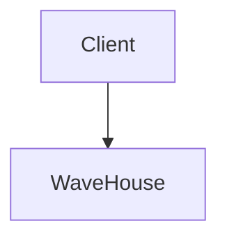

# astro-themed-mermaid

Build-time, theme-aware [Mermaid](https://mermaid.js.org/) diagrams for Astro /
Starlight docs sites. Renders diagrams with
[`rehype-mermaid`](https://github.com/remcohaszing/rehype-mermaid) (inline SVG,
SSR'd at build), then rewrites the emitted SVG to:

- **survive Chromium's HTML parser** — `<br></br>` → `<br>` (Mermaid emits the
  former; the void end tag otherwise renders an extra line and overflows the
  `<foreignObject>`);
- **respond to light/dark themes** — baked colors are rewritten to `var(--…)`
  references you supply, so a runtime stylesheet drives them;
- **polish flowcharts** — cluster-title pills are re-centered over the subgraph
  border and lifted above edges/nodes; Mermaid's forced white label color is
  stripped so themed text works in light mode; the viewBox is expanded so the
  straddling title pill isn't clipped.

It is **color-agnostic**: the module defines no colors. You pass the Mermaid
theme, the classDef palette, and the hex→CSS-var replacement map; the displayed
colors live wherever those CSS variables are defined (your stylesheet). That's
what makes it shareable across docs sites with different brands.

## Install

```sh
pnpm add github:Wave-RF/astro-themed-mermaid#v0.2.0 rehype-mermaid
```

`rehype-mermaid` (and its peer `mermaid`) is a peer dependency — you wire it up
yourself (see below). Pin to a tag (or commit SHA) rather than a floating
branch; your lockfile then records the exact resolved commit.

> Diagram SSR needs a headless Chromium. `rehype-mermaid` uses Playwright —
> `pnpm exec playwright install chromium` (Astro/Starlight setups usually do
> this already).

## Usage

```js
// astro.config.mjs
import { defineConfig } from "astro/config";
import { themedMermaid } from "astro-themed-mermaid";

const mermaid = themedMermaid({
  font: { family: '"Inter Variable", sans-serif', woff2: "/abs/path/to/inter.woff2" },
  themeVariables: { primaryColor: "#14171C", lineColor: "#6B7280", /* … */ },
  classDefs: ["classDef wh fill:#0e7f8f,stroke:#5bbfcf,color:#fff,stroke-width:3px", /* … */],
  colorReplacements: [
    ["#14171C", "var(--mermaid-surface)"],
    ["#0e7f8f", "var(--mermaid-wh-bg)"],
    // …baked hex (exactly as Mermaid serializes) → your CSS variable
  ],
  flowchart: { curve: "basis", useMaxWidth: true /* … */ },
  sequence: { useMaxWidth: true, wrap: false },
});

export default defineConfig({
  markdown: {
    remarkPlugins: [mermaid.remarkInjectClassdefs],
    rehypePlugins: [mermaid.rehypeMermaid],
  },
  integrations: [/* starlight(...), */ mermaid.integration],
});
```

Then author diagrams normally, using the injected classes:

````md

````

A complete, copy-pasteable config + stylesheet lives in [`example/`](./example).

## Render cache

`mermaid.rehypeMermaid` wraps `rehype-mermaid` with a per-diagram render cache,
because diagram SSR goes through a headless Chromium and dominates the build
time of any site that didn't touch its diagrams — i.e. almost every build. The
cache is content-addressed: each entry is keyed on
`sha256(diagram source + render options + package versions)`, so theme,
config, and toolchain changes invalidate automatically, and the entry stores
the rendered hast element exactly as `rehype-mermaid` would have spliced it
(ids are rewritten to content-derived ones so entries from different builds
can't collide on one page). A document whose diagrams all hit never launches
the browser — nor even imports `rehype-mermaid`; a document with any miss is
rendered by `rehype-mermaid` as one normal batch and harvested back into the
cache. Cache I/O is best-effort: a corrupt or unwritable cache degrades to a
normal render, never a failed build.

Entries land in `node_modules/.cache/astro-themed-mermaid/` by default —
delete it freely. Configure via `cache`:

```js
themedMermaid({ cache: ".mermaid-cache" }); // custom dir (resolved from cwd)
themedMermaid({ cache: false });            // disable; render every build
```

In CI the directory is cold unless you persist it (e.g. `actions/cache` keyed
on the lockfile); with it persisted, diagram-free doc changes skip Chromium
entirely. The uncached spelling
`rehypePlugins: [[rehypeMermaid, mermaid.rehypeMermaidOptions]]` keeps working
if you prefer to wire `rehype-mermaid` yourself.

## Styling

The plugin rewrites SVG *geometry* and swaps in your CSS variables; the matching
*visuals* (pill chips, drop-shadows, typography) are CSS. Two options:

1. **Use the bundled stylesheet** (fastest):

   ```js
   // in your global CSS, or customCss in Starlight
   import "astro-themed-mermaid/styles.css";
   ```

   then define the color variables it reads (`--mermaid-surface`, `--mermaid-ink`,
   `--mermaid-ink-muted`, `--mermaid-border`, `--mermaid-cluster-border`) plus the
   `colorReplacements` right-hand sides (`--mermaid-wh-bg`, …) for light/dark.
   See [`example/mermaid.css`](./example/mermaid.css).

2. **Write your own** scoped via `svg[aria-roledescription^="flowchart"]` — copy
   `styles.css` as a starting point and tune freely.

> **Paired magic numbers.** The plugin expands the flowchart viewBox up by 22px
> (`PAD_TOP` in `index.mjs`) precisely so the cluster-title pill — shifted up
> `translateY(-17px)` in the CSS — isn't clipped. If you change one, revisit the
> other.

## Config

| key | type | purpose |
|---|---|---|
| `font.family` | string | font for build-time SSR measurement |
| `font.woff2` | string (abs path) | woff2 inlined into build Chromium so it measures with the real font |
| `themeVariables` | object | Mermaid `base` theme variables (build-time hex) |
| `classDefs` | string[] | `classDef …` lines injected into every flowchart/graph block |
| `colorReplacements` | `[from,to][]` | baked color → runtime CSS var; the **only** place colors enter |
| `flowchart`, `sequence` | object | non-color Mermaid config |
| `securityLevel` | string | Mermaid securityLevel (default `"strict"`) |

The factory returns three things to wire up:

| return value | wire into |
|---|---|
| `remarkInjectClassdefs` | `markdown.remarkPlugins` |
| `rehypeMermaidOptions` | `markdown.rehypePlugins: [[rehypeMermaid, …]]` |
| `integration` | `integrations` |

## How it works

`classDefs` are injected (via the remark plugin) after each flowchart/graph
header, so source diagrams use `:::name` without restating the palette. Mermaid
renders to inline SVG at build time with concrete hex (it needs real colors to
lay out geometry). The Astro integration then post-processes the built HTML:
normalizes `<br></br>`, swaps each baked hex for your `var(--…)`, strips
Mermaid's forced-white label color, and (for flowcharts) lifts + centers the
cluster-title pills and pads the viewBox. The hex are effectively sentinels —
only the right-hand side of `colorReplacements` (your var names) reaches the
browser, where your stylesheet drives the actual colors in both themes.

## Caveats

The SVG rewriting is regex over Mermaid's output, which can change between
Mermaid versions (developed against **Mermaid v11.x**). Pin `mermaid` and
re-verify diagrams after upgrades. `pnpm test` runs a smoke test over the
rewrite passes to catch gross breakage.

## License

MIT © Wave RF
