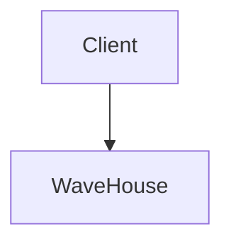

# @wave-rf/astro-themed-mermaid

Build-time, theme-aware [Mermaid](https://mermaid.js.org/) diagrams for Astro /
Starlight docs sites. Renders diagrams with
[`rehype-mermaid`](https://github.com/remcohaszing/rehype-mermaid) (inline SVG,
SSR'd at build), then rewrites the emitted SVG to:

- **survive Chromium's HTML parser** — `<br></br>` → `<br>` (Mermaid emits the
  former; the void end tag otherwise renders an extra line and overflows the
  `<foreignObject>`);
- **respond to light/dark themes** — baked colors are rewritten to `var(--…)`
  references you supply, so a runtime stylesheet drives them;
- **polish flowcharts** — cluster-title pills are re-centered over the subgraph
  border and lifted above edges/nodes; Mermaid's forced white label color is
  stripped so themed text works in light mode; the viewBox is expanded so the
  straddling title pill isn't clipped.

It is **color-agnostic**: the module defines no colors. You pass the Mermaid
theme, the classDef palette, and the hex→CSS-var replacement map; the displayed
colors live wherever those CSS variables are defined (your stylesheet). That's
what makes it shareable across docs sites with different brands.

## Install

```sh
pnpm add @wave-rf/astro-themed-mermaid rehype-mermaid
```

`rehype-mermaid` (and its peer `mermaid`) is a peer dependency — you wire it up
yourself (see below).

Published under semver: `^0.3.0` tracks features and fixes without breaking
changes (during `0.x`, breaking changes bump the minor). For the bleeding edge,
the `dev` dist-tag follows `main`: `pnpm add @wave-rf/astro-themed-mermaid@dev`.

> Diagram SSR needs a headless Chromium. `rehype-mermaid` uses Playwright —
> `pnpm exec playwright install chromium` (Astro/Starlight setups usually do
> this already).

## Usage

```js
// astro.config.mjs
import { defineConfig } from "astro/config";
import { themedMermaid } from "@wave-rf/astro-themed-mermaid";

const mermaid = themedMermaid({
  font: { family: '"Inter Variable", sans-serif', woff2: "/abs/path/to/inter.woff2" },
  themeVariables: { primaryColor: "#14171C", lineColor: "#6B7280", /* … */ },
  classDefs: ["classDef wh fill:#0e7f8f,stroke:#5bbfcf,color:#fff,stroke-width:3px", /* … */],
  colorReplacements: [
    ["#14171C", "var(--mermaid-surface)"],
    ["#0e7f8f", "var(--mermaid-wh-bg)"],
    // …baked hex (exactly as Mermaid serializes) → your CSS variable
  ],
  flowchart: { curve: "basis", useMaxWidth: true /* … */ },
  sequence: { useMaxWidth: true, wrap: false },
});

export default defineConfig({
  markdown: {
    remarkPlugins: [mermaid.remarkInjectClassdefs],
    rehypePlugins: [mermaid.rehypeMermaid],
  },
  integrations: [/* starlight(...), */ mermaid.integration],
});
```

Then author diagrams normally, using the injected classes:

````md

```mermaid
flowchart TD
  A["Client"]:::client --> B["WaveHouse"]:::wh
```
````

A complete, copy-pasteable config + stylesheet lives in [`example/`](./example).

## Diagram extras: PNG export, zoom lightbox, dev tools

Four optional features that sit on top of the core plugin. Each is its own
subpath import, so a site that doesn't use them pays nothing. They share the
package's color-agnostic design: they read your `--mermaid-*` CSS variables and
define no palette of their own (beyond neutral fallbacks and a checkerboard for the transparency preview).

| feature | import | needs Playwright |
|---|---|---|
| PNG export | `@wave-rf/astro-themed-mermaid/png` | yes (build time) |
| Zoom lightbox | `@wave-rf/astro-themed-mermaid/zoom` (+ `zoom.css`) | no |
| `audit` / `screenshot` tools | `astro-themed-mermaid` bin | yes |
| Shared path/slug helpers | `@wave-rf/astro-themed-mermaid/shared` | no |

`playwright` is an **optional peer dependency**: install it only if you use PNG
export or the tools (`pnpm add -D playwright && pnpm exec playwright install chromium`;
it must be resolvable from your project root, i.e. a direct dependency. If it
can't be found, the build only warns: `diagram PNG export skipped`).
The core plugin never imports it.

### PNG export (`/png`)

After the build, drives Chromium over the built pages and writes a PNG of every
diagram, per theme, solid and transparent (for slide decks), to
`dist/diagrams/<slug>/<index>-<theme>[-transparent].png`. `<slug>` is the page
path (`/guide/intro/` -> `guide/intro`, the home page is `index`) and `<index>`
is the diagram's position among `selector` matches. Each diagram is rendered
alone on a padded card, so no site chrome ends up behind a transparent export.

```js
// astro.config.mjs
import { defineConfig } from "astro/config";
import { themedMermaid } from "@wave-rf/astro-themed-mermaid";
import { diagramPng } from "@wave-rf/astro-themed-mermaid/png";

const mermaid = themedMermaid({ /* … */ });

export default defineConfig({
  markdown: { /* remark/rehype wiring as in Usage */ },
  integrations: [
    mermaid.integration,
    diagramPng(), // list it last: it reads the finished HTML
  ],
});
```

| option | default | purpose |
|---|---|---|
| `selector` | `svg[aria-roledescription]` | which SVGs are diagrams. **Must match `diagramZoom`'s** |
| `themes` | `["light", "dark"]` | one PNG set per theme name |
| `themeAttr` | `"data-theme"` | attribute set on `<html>` to select a theme before first paint |
| `themeStorageKey` | `null` | localStorage key your site reads its theme from (Starlight: `"starlight-theme"`) |
| `surfaceVar` | `"--mermaid-surface"` | CSS variable for the solid card background |
| `scale` | `2` | device scale factor (retina) |
| `pad` | `28` | card padding, CSS px |
| `maxDim` | `2400` | cap on a diagram's long edge, CSS px |
| `variants` | solid + `-transparent` | `{ suffix, transparent }[]` rendered per diagram |
| `outDir` | `"diagrams"` | directory under the build output (and URL path) |
| `cacheDir` | `"node_modules/.cache/astro-themed-mermaid-png"` | per-page render cache (project-relative), or `false` |
| `skipEnv` | `"ASTRO_THEMED_MERMAID_SKIP_PNG"` | env var that skips the export when set to `1` |

Notes: a browser failure only logs a warning (the site is already built);
Playwright is resolved from **your** project, not this package; with an Astro
`base`, assets and slugs are handled for you. The export sets `themeAttr` on
`<html>` before first paint. If your site re-reads its theme from localStorage
at load (Starlight does), also set `themeStorageKey` (`"starlight-theme"`), or
every theme renders identically. The CLI's `--theme-storage-key` is the same.

### Zoom lightbox (`/zoom`)

Click (or Enter on) any diagram to open it in a lightbox that always fits the
viewport; oversized diagrams get a 1:1 pan toggle with edge fades. When the
build-time PNGs exist, Copy / Download / transparent-background buttons appear
(they stay hidden under `astro dev`, which runs no build hook). It is an Astro
integration: it injects the script and stylesheet into every page, so there is
no component to mount.

```js
import { diagramZoom } from "@wave-rf/astro-themed-mermaid/zoom";

export default defineConfig({
  integrations: [mermaid.integration, diagramZoom(), diagramPng()],
});
```

| option | default | purpose |
|---|---|---|
| `selector` | `svg[aria-roledescription]` | which SVGs are diagrams. **Must match `diagramPng`'s** |
| `png` | `true` | show Copy/Download/background buttons when a PNG exists |
| `outDir` | `"diagrams"` | where `diagramPng` wrote PNGs (match its `outDir`) |
| `themes` | `["light", "dark"]` | theme names PNGs exist for |
| `themeAttr` | `"data-theme"` | attribute carrying the site theme; if unset on the page, `prefers-color-scheme` decides |
| `themeTarget` | `"html"` | selector of the element carrying that attribute |
| `filenamePrefix` | `""` | prefix for downloaded files (`<prefix>-<slug>-diagram-<n>.png`) |
| `css` | `true` | inject the bundled `zoom.css`; `false` to style it yourself |
| `labels` | English | any subset of the UI strings (see `DEFAULT_LABELS`) |

Styling is `@wave-rf/astro-themed-mermaid/zoom.css`, built on the variables you
already define (`--mermaid-surface`, `--mermaid-ink`, `--mermaid-border`,
`--mermaid-cluster-border`) plus optional `--mermaid-zoom-backdrop`,
`--mermaid-zoom-surface`, `--mermaid-zoom-ink`, `--mermaid-zoom-border`,
`--mermaid-zoom-accent`, `--mermaid-zoom-radius`, `--mermaid-zoom-z`.

> **Index agreement.** The lightbox asks for `…/<index>-<theme>.png`, where
> `<index>` is the diagram's DOM position among `selector` matches. The PNG
> export numbers them the same way. Both default to one shared constant
> (`DEFAULT_SELECTOR`, exported from `/shared`); if you narrow the selector for
> one (e.g. Starlight's `.sl-markdown-content svg[aria-roledescription]`), pass
> the **same** value to the other, or Copy/Download will fetch the wrong diagram.

Starlight example:

```js
const selector = ".sl-markdown-content svg[aria-roledescription]";
integrations: [
  mermaid.integration,
  diagramZoom({ selector }),
  diagramPng({ selector, themeStorageKey: "starlight-theme" }),
];
```

### Dev tools (`astro-themed-mermaid audit | screenshot`)

Both load the **built** site (`astro build` output) in headless Chromium with its
real stylesheet applied, so what you measure is what ships. Run from the project
root after a build:

```sh
pnpm exec astro-themed-mermaid audit      # measurements -> screenshots/audit.json
pnpm exec astro-themed-mermaid screenshot # screenshots/<page>-<theme>-<n>.png
```

- `audit` reports edge-label centering vs. the nearest edge, cylinder label
  offset, cluster-title pill straddle, and per-class node fill/label WCAG
  contrast. Numbers, not opinions.
- `screenshot` writes one PNG per diagram per theme, for visual regression.

Options (both): `--dist` (default `dist`), `--out` (`screenshots`), `--pages a,b`
(default: every built page with a diagram), `--selector`, `--themes`,
`--theme-attr`, `--theme-storage-key`, `--base`; `screenshot` also takes
`--scale` (default `2`). Run with no arguments for help.

## Render cache

`mermaid.rehypeMermaid` wraps `rehype-mermaid` with a per-diagram render cache,
because diagram SSR goes through a headless Chromium and dominates the build
time of any site that didn't touch its diagrams — i.e. almost every build. The
cache is content-addressed: each entry is keyed on
`sha256(diagram source + render options + package versions)`, so theme,
config, and toolchain changes invalidate automatically, and the entry stores
the rendered hast element exactly as `rehype-mermaid` would have spliced it
(ids are rewritten to content-derived ones so entries from different builds
can't collide on one page). A document whose diagrams all hit never launches
the browser — nor even imports `rehype-mermaid`; a document with any miss is
rendered by `rehype-mermaid` as one normal batch and harvested back into the
cache. Cache I/O is best-effort: a corrupt or unwritable cache degrades to a
normal render, never a failed build.

Entries land in `node_modules/.cache/astro-themed-mermaid/` by default —
delete it freely. Configure via `cache`:

```js
themedMermaid({ cache: ".mermaid-cache" }); // custom dir (resolved from cwd)
themedMermaid({ cache: false });            // disable; render every build
```

In CI the directory is cold unless you persist it (e.g. `actions/cache` keyed
on the lockfile); with it persisted, diagram-free doc changes skip Chromium
entirely. The uncached spelling
`rehypePlugins: [[rehypeMermaid, mermaid.rehypeMermaidOptions]]` keeps working
if you prefer to wire `rehype-mermaid` yourself.

## Styling

The plugin rewrites SVG *geometry* and swaps in your CSS variables; the matching
*visuals* (pill chips, drop-shadows, typography) are CSS. Two options:

1. **Use the bundled stylesheet** (fastest):

   ```js
   // in your global CSS, or customCss in Starlight
   import "@wave-rf/astro-themed-mermaid/styles.css";
   ```

   then define the color variables it reads (`--mermaid-surface`, `--mermaid-ink`,
   `--mermaid-ink-muted`, `--mermaid-border`, `--mermaid-cluster-border`) plus the
   `colorReplacements` right-hand sides (`--mermaid-wh-bg`, …) for light/dark.
   See [`example/mermaid.css`](./example/mermaid.css).

2. **Write your own** scoped via `svg[aria-roledescription^="flowchart"]` — copy
   `styles.css` as a starting point and tune freely.

> **Paired magic numbers.** The plugin expands the flowchart viewBox up by 22px
> (`PAD_TOP` in `index.mjs`) precisely so the cluster-title pill — shifted up
> `translateY(-17px)` in the CSS — isn't clipped. If you change one, revisit the
> other.

## Config

| key | type | purpose |
|---|---|---|
| `font.family` | string | font for build-time SSR measurement |
| `font.woff2` | string (abs path) | woff2 inlined into build Chromium so it measures with the real font |
| `measurementCss` | string | label-metric CSS injected at measure time (see [Label clipping](#label-clipping)) |
| `themeVariables` | object | Mermaid `base` theme variables (build-time hex) |
| `classDefs` | string[] | `classDef …` lines injected into every flowchart/graph block |
| `colorReplacements` | `[from,to][]` | baked color → runtime CSS var; the **only** place colors enter |
| `flowchart`, `sequence` | object | non-color Mermaid config |
| `securityLevel` | string | Mermaid securityLevel (default `"strict"`) |
| `mermaidConfig` | object | escape hatch for other non-color Mermaid settings; merged **beneath** the module's own config (which wins) |

> **`mermaidConfig`** is for Mermaid settings this plugin doesn't surface
> directly (e.g. `gantt`, `er`, `pie`, `htmlLabels`, `maxTextSize`). It's merged
> *beneath* the module's own config, so it can't override the
> theme/color/security settings — the color-agnostic invariant holds.

The factory returns four things to wire up:

| return value | wire into |
|---|---|
| `remarkInjectClassdefs` | `markdown.remarkPlugins` |
| `rehypeMermaid` | `markdown.rehypePlugins` (recommended — the cached drop-in) |
| `rehypeMermaidOptions` | `markdown.rehypePlugins: [[rehypeMermaid, …]]` (uncached; wire `rehype-mermaid` yourself) |
| `integration` | `integrations` |

## Label clipping

Mermaid sizes each node's box by **measuring** the label in the build-time
Chromium; the browser then **displays** it. If display is even ~1px wider than
the measurement, the `<foreignObject>` crops the last glyph (`Buffer Consumer`
→ `Buffer Consume`). Two things cause that drift, and both are fixed by feeding
the build the same inputs the browser uses:

- **Font** — set `font.woff2` so the real font is loaded at measure time
  (a fallback like Arial measures ~6–8% narrower than Inter).
- **Label metrics** — if your stylesheet renders labels at, say,
  `font-weight: 500` (or any `letter-spacing`), Mermaid measured them at the
  default `400` and every box is a hair too narrow. Pass those rules as
  `measurementCss`:

  ```js
  themedMermaid({
    font: { family: '"Inter Variable", sans-serif', woff2: "/abs/inter.woff2" },
    // matches what your global CSS applies to node labels at display time,
    // plus a hair of padding for sub-pixel safety:
    measurementCss:
      ".nodeLabel p{font-weight:500;letter-spacing:-0.005em;padding-inline:1.5px;}",
  });
  ```

  > **Selectors must be bare.** Mermaid measures the label *before* it's
  > parented by the final `svg[aria-roledescription="flowchart…"]`, so a rule
  > scoped as `svg[aria-roledescription^="flowchart"] .nodeLabel p { … }`
  > matches at **display** time but is a **no-op at measure time**. Drop the
  > ancestor: `.nodeLabel p { … }`. (Edge/cluster labels usually render as
  > `overflow: visible` pills and don't need this — scope to `.nodeLabel p`.)

## How it works

`classDefs` are injected (via the remark plugin) after each flowchart/graph
header, so source diagrams use `:::name` without restating the palette. Mermaid
renders to inline SVG at build time with concrete hex (it needs real colors to
lay out geometry). The Astro integration then post-processes the built HTML:
normalizes `<br></br>`, swaps each baked hex for your `var(--…)`, strips
Mermaid's forced-white label color, and (for flowcharts) lifts + centers the
cluster-title pills and pads the viewBox. The hex are effectively sentinels —
only the right-hand side of `colorReplacements` (your var names) reaches the
browser, where your stylesheet drives the actual colors in both themes.

## Caveats

The SVG rewriting is regex over Mermaid's output, which can change between
Mermaid versions (developed against **Mermaid v11.x**). Pin `mermaid` and
re-verify diagrams after upgrades. `pnpm test` runs a smoke test over the
rewrite passes to catch gross breakage.

## License

MIT © Wave RF
